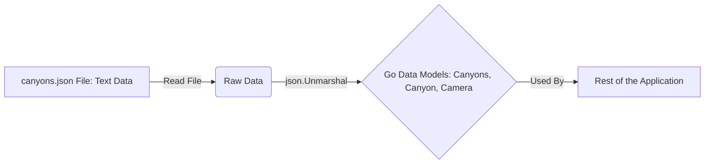

# Chapter 1: Data Models (`Canyons`, `Camera`, `Image`)

Welcome to the `lcc.live` tutorial! We're going to explore how this project works, piece by piece. Let's start with the very foundation: how the application understands and organizes its information.

Imagine you're building a website that shows live camera feeds from mountain canyons. You need to keep track of *which* cameras exist, *where* their video feeds come from, and *which* canyon they belong to. If you just had a messy list, it would be hard to manage, especially if you add more cameras or canyons later.

This is where **Data Models** come in. Think of them like blueprints or fill-in-the-blank forms. They define exactly *what* information we need for each piece of data. For `lcc.live`, we have a few key blueprints:

1.  `Camera`: A form for describing a single camera.
2.  `Image`: A form for describing the actual picture data from a camera.
3.  `Canyons`: A form for organizing all the cameras within specific canyons (like Little Cottonwood Canyon - LCC, and Big Cottonwood Canyon - BCC).

Using these models ensures that every time we talk about a "Camera" in our code, it always has the same kinds of information (like an ID, a source URL, etc.). This keeps everything organized and consistent.

## What's in a Blueprint? The `Camera` Model

Let's look at the blueprint for a single camera. In the code, this is defined using a Go `struct`. Don't worry too much about the Go syntax yet; focus on the information it holds:

```go
// File: store/models.go

// Camera defines the structure for camera information
type Camera struct {
	ID     string `json:"id"`    // Unique identifier for the camera
	Kind   string `json:"kind"`  // Type of camera (e.g., image, iframe)
	Src    string `json:"src"`   // URL where the camera image/feed comes from
	Alt    string `json:"alt"`   // Alternative text (description) for the camera
	Canyon string `json:"canyon"`// Which canyon this camera belongs to (LCC or BCC)
}
```

This `Camera` blueprint tells us that every camera *must* have:

*   `ID`: A unique name or code (like "LCC_Entry_Cam").
*   `Kind`: What type of content it provides (usually an "image").
*   `Src`: The web address (URL) to get the latest picture from.
*   `Alt`: A short description (e.g., "Camera at LCC Entry").
*   `Canyon`: The canyon it's in ("LCC" or "BCC").

It's like an ID card for each camera, ensuring we always have these key details.

## What about the Actual Pictures? The `Image` Model

Okay, we know *about* the cameras, but what about the pictures they take? We need a blueprint for that too:

```go
// File: store/models.go

// Image defines the structure for holding image data
type Image struct {
	Src   string // The original source URL (might be useful later)
	ETag  string // A unique code representing this specific version of the image
	Bytes []byte // The actual image data, like the bytes of a JPEG file
}
```

This `Image` blueprint holds:

*   `Src`: The URL where this image originally came from.
*   `ETag`: A special code (like a version number or fingerprint) that changes if the image content changes. This helps with caching, so we don't reload the same image unnecessarily.
*   `Bytes`: The raw data of the image itself. This is what gets displayed on the webpage.

Think of this like the actual photograph developed from a camera, along with a note saying when and where it was taken.

## Organizing Everything: The `Canyons` Model

We have blueprints for individual cameras and their images. Now, how do we group them by canyon? We use the `Canyons` blueprint:

```go
// File: store/models.go

// Canyon holds information about cameras within a specific canyon
type Canyon struct {
	Name    string   `json:"name"`    // Name of the canyon (e.g., "Little Cottonwood Canyon")
	ETag    string   `json:"etag"`    // A unique code for the *entire* canyon's data state
	Status  Camera   `json:"status"`  // Special camera showing the canyon's road status
	Cameras []Camera `json:"cameras"` // A list of all regular cameras in this canyon
}

// Canyons holds the data for both main canyons
type Canyons struct {
	LCC Canyon `json:"lcc"` // Data for Little Cottonwood Canyon
	BCC Canyon `json:"bcc"` // Data for Big Cottonwood Canyon
}
```

Let's break this down:

1.  `Canyon`: This blueprint describes *one* canyon.
    *   It has a `Name`.
    *   It has an `ETag` (like the `Image` ETag, but representing all data for this canyon).
    *   It has a special `Status` camera (using the `Camera` blueprint!) that shows if the road is open or closed.
    *   It has a `Cameras` list, which contains multiple `Camera` objects (using the `Camera` blueprint again!).
2.  `Canyons`: This is the top-level blueprint. It simply holds two `Canyon` objects, one named `LCC` and one named `BCC`.

Analogy: `Canyons` is like a filing cabinet. Inside, there are two drawers, `LCC` and `BCC`. Each drawer (`Canyon`) contains a special status report (`Status` camera) and a folder full of individual camera ID cards (`Cameras` list).

## Filling the Blueprints: Loading the Data

These blueprints are great, but they start empty. We need to fill them with actual camera and canyon information. `lcc.live` does this by reading a configuration file (usually `canyons.json`).

Here's a simplified look at how the `Canyons` model gets filled from the file:

```go
// File: store/models.go (simplified concept)

import (
	"encoding/json" // Package to handle JSON data
	"io/fs"         // Package for reading files
)

// Load reads the canyon configuration from a file
func (c *Canyons) Load(filesystem fs.FS, filepath string) error {
	// 1. Read the file content (e.g., canyons.json)
	data, err := filesystem.(fs.ReadFileFS).ReadFile(filepath)
	// ... (error handling) ...

	// 2. Parse the JSON data and fill the Canyons struct
	// This matches the keys in the JSON file (like "lcc", "cameras", "src")
	// to the fields in our Go structs (Canyons, Canyon, Camera).
	err = json.Unmarshal(data, c)
	// ... (error handling and validation) ...

	// 3. Calculate ETags (unique fingerprints for caching)
	// We'll learn more about ETags later.
	c.setETag(&c.LCC)
	c.setETag(&c.BCC)

	return nil
}
```

This `Load` function essentially does two main things:

1.  Reads the `canyons.json` file.
2.  Uses `json.Unmarshal` to automatically match the data in the file to the fields defined in our `Canyons`, `Canyon`, and `Camera` blueprints (structs). The `json:"..."` tags in the struct definitions help Go know which JSON field corresponds to which struct field.

It's like taking the filled-out paper forms (the JSON data) and neatly filing them into the correct sections of our digital filing cabinet (the Go structs).


## How are these Models Used?

Once loaded, these data models are used everywhere in the application. For example, when you visit the webpage for Little Cottonwood Canyon:

1.  The web server needs to get the data for LCC.
2.  It asks the central [In-Memory Data Store (`Store`)](02_in_memory_data_store___store___.md) (which we'll cover in the next chapter) for the `LCC` Canyon data.
3.  The Store provides the filled-in `Canyon` model for LCC.
4.  The server then uses this `Canyon` model (containing the list of `Camera` models for LCC) to generate the HTML page you see in your browser.

Here's a tiny peek at the code that handles the LCC page request:

```go
// File: server/canyon_route.go (simplified)

func CanyonRoute(store *store.Store, canyonID string) func(c echo.Context) error {
	return func(c echo.Context) error {
		// 1. Ask the store for the specific Canyon model
		canyon := store.Canyon(canyonID) // e.g., canyonID is "LCC"

		// 2. Use the 'canyon' model (which has Name, Status, Cameras)
		//    to render the HTML template for the webpage.
		//    The template uses fields like canyon.Name, canyon.Status.Src,
		//    and loops through canyon.Cameras to display each one.
		return c.Render(http.StatusOK, "canyon.html.tmpl", canyon)
	}
}
```

The `canyon` variable here holds the structured data according to our `Canyon` blueprint, making it easy and reliable for the web server to use.

## Conclusion

We've learned about the fundamental concept of **Data Models** (`Canyons`, `Camera`, `Image`) in `lcc.live`. They act as blueprints, defining the structure for our application's data. This ensures consistency and organization, making it easier to manage information about canyons and cameras. We saw how these models are defined using Go structs and how they get filled with data loaded from a configuration file.

These models are the "what" – *what* information we store. But *how* do we store and manage this information efficiently while the application is running? That's where our next topic comes in!

Next up: [In-Memory Data Store (`Store`)](02_in_memory_data_store___store___.md)

---

Generated by [AI Codebase Knowledge Builder](https://github.com/The-Pocket/Tutorial-Codebase-Knowledge)
