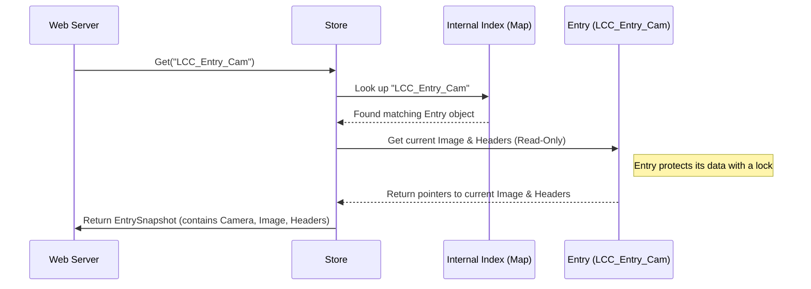

# Chapter 2: In-Memory Data Store (`Store`)

In [Chapter 1: Data Models (`Canyons`, `Camera`, `Image`)](01_data_models___canyons____camera____image___.md), we learned about the blueprints (`structs`) that define how `lcc.live` organizes information about canyons and cameras. We know *what* the data looks like. But where does this data live while the application is running, and how do we access it quickly?

Imagine you need the very latest photo from a specific mountain camera *right now*. If the application had to read the camera information from a file on the hard drive, then go to the internet to fetch the image *every single time* you asked, it would be quite slow!

This is where the **In-Memory Data Store (`Store`)** comes in. It's the application's central memory bank, holding all the crucial information directly in the computer's fast RAM (Random Access Memory).

## The Librarian on Duty: What is the `Store`?

Think of the `Store` like a helpful librarian managing a special, frequently accessed collection. Instead of putting everything away in deep storage (like a hard drive or even the original website the image came from), this librarian keeps the most important items right on their desk for instant access.

In `lcc.live`, the `Store` keeps:

1.  **Canyon Information:** The details about Little Cottonwood Canyon (LCC) and Big Cottonwood Canyon (BCC), loaded from the configuration file as we saw in Chapter 1. This uses the `Canyons` data model.
2.  **Camera Information:** The details for *every* camera within those canyons. This uses the `Camera` data model.
3.  **The Latest Images:** Crucially, the `Store` also holds the *actual image data* (the picture bytes) that it has most recently fetched for each camera. This uses the `Image` data model.

Because all this data is "in-memory" (in RAM), retrieving it is incredibly fast – much faster than reading from a file or fetching from the internet every time.

The `Store` isn't just a passive holder of data; it's also responsible for *managing* it, particularly the images. It periodically checks the original camera sources for new pictures and updates its own stored copies. We'll explore how it does this updating in a later chapter on [Background Image Syncing](05_background_image_syncing_.md).

## How is the `Store` Used?

Let's see how other parts of the application interact with the `Store`.

### 1. Creating the Store

First, when the application starts, it needs to create the `Store` and load the initial canyon and camera configuration. This uses the `Load` function we saw in Chapter 1.

```go
// File: main.go (Simplified Startup)

import (
	"log"
	"github.com/stefanpenner/lcc-live/store"
	// ... other imports ...
	"embed"
)

//go:embed data.json
var dataFS embed.FS // Embeds the data.json file into the app

func main() {
	// ... setup ...

	// Create a new Store, loading configuration from data.json
	// dataFS is the embedded file system containing data.json
	appStore, err := store.NewStoreFromFile(dataFS, "data.json")
	if err != nil {
		log.Fatalf("Failed to create store: %v", err)
	}

	// Now 'appStore' holds all the Canyon/Camera info in memory.
	// It will soon start fetching images too (more on this later).

	// ... start web server using appStore ...
}
```

This code snippet shows the `main` function creating the `Store` instance (`appStore`) by calling `store.NewStoreFromFile`. This function reads `data.json`, parses it into our `Canyons`, `Canyon`, and `Camera` data models (as discussed in Chapter 1), and sets up the initial internal structure of the `Store`.

### 2. Getting Data from the Store

Once the `Store` is created and running, other parts of the application can ask it for data. For example, the [Web Server & Routing (Echo)](03_web_server___routing__echo__.md) needs data to build the web pages.

**Example Use Case:** Getting the latest image for a specific camera to display on the webpage.

Let's say the web server needs the image for the camera whose unique ID is `"LCC_Entry_Cam"`. It would ask the `Store` like this:

```go
// File: server/image_route.go (Conceptual)

import (
    "github.com/stefanpenner/lcc-live/store"
    // ... other imports ...
)

func handleImageRequest(appStore *store.Store, cameraID string) {
    // Ask the store for the data associated with cameraID
    entrySnapshot, found := appStore.Get(cameraID)

    if !found {
        // Handle case where the camera ID doesn't exist
        // ... display an error or default image ...
        return
    }

    // We got the data! 'entrySnapshot' contains:
    // - entrySnapshot.Camera // Info about the camera (like Src, Alt)
    // - entrySnapshot.Image  // The actual image data (Bytes, ETag)
    // - entrySnapshot.HTTPHeaders // Caching info (ETag, ContentType)

    // Now we can use entrySnapshot.Image.Bytes to send the
    // picture back to the user's browser.
    // We also use entrySnapshot.HTTPHeaders to tell the browser
    // how to cache the image efficiently.
    // ... send image data to browser ...
}

// Somewhere else, this function would be called:
// handleImageRequest(appStore, "LCC_Entry_Cam")
```

**Explanation:**

1.  `appStore.Get(cameraID)`: This is the key call. We ask the `Store` for the data associated with the given `cameraID`.
2.  `entrySnapshot, found`: The `Get` method returns two things:
    *   `entrySnapshot`: A structure containing the `Camera` info, the latest fetched `Image` data, and some helpful `HTTPHeaders` for web serving. We'll see why it's a "snapshot" later.
    *   `found`: A boolean (`true` or `false`) indicating if a camera with that ID actually exists in the `Store`.
3.  **Using the Data:** If `found` is `true`, we can access the image bytes (`entrySnapshot.Image.Bytes`) and other details to send the picture to the user.

This is much faster than fetching the image from the original source every time! The `Store` gives us the copy it already has in memory.

## Under the Hood: How the `Store` Works Internally

Okay, asking the `Store` for data seems simple, but how does it manage everything internally?

### High-Level Walkthrough: Getting an Image

Let's trace the `appStore.Get("LCC_Entry_Cam")` call:



1.  **Web Server asks:** The web server calls `Get` on the `Store` with the camera ID.
2.  **Store looks up:** The `Store` uses an internal `index` (like a super-fast digital address book or map) to quickly find the internal data structure (`Entry`) associated with `"LCC_Entry_Cam"`.
3.  **Entry provides data:** The `Entry` holds the `Camera` info, the current `Image`, and `HTTPHeaders`. It allows the `Store` to read this information safely (using mechanisms we'll touch on in [Concurrency Management (`context`, `goroutines`, `sync`)](06_concurrency_management___context____goroutines____sync___.md)).
4.  **Store returns snapshot:** The `Store` packages the relevant information into an `EntrySnapshot` and returns it to the web server.

### Key Internal Structures

The `Store` itself uses a few important pieces internally:

```go
// File: store/store.go (Simplified)

package store

import (
	"sync"
	// ... other imports ...
)

// Entry holds the live data for a single camera
type Entry struct {
	Camera      *Camera       // Info about the camera (immutable after load)
	Image       *Image        // Pointer to the LATEST fetched image data
	HTTPHeaders *HTTPHeaders  // Pointer to LATEST HTTP headers
	ID          string        // The unique ID (e.g., based on Src URL hash)
	mu          sync.RWMutex  // PROTECTS access to Image/HTTPHeaders pointers
}

// Store is the main in-memory data store
type Store struct {
	canyons *Canyons          // Holds the loaded LCC/BCC structure
	index   map[string]*Entry // FAST lookup: Camera ID -> Entry
	entries []*Entry          // List of all entries (useful for iteration)
	mu      sync.RWMutex      // Protects the index/entries lists themselves (rarely needed)
	// ... other fields like http client, sync helpers ...
}
```

**Explanation:**

*   **`Entry`:** This struct holds the *live* data for one camera. Notice the `Image` and `HTTPHeaders` fields. When a new image is fetched, the `Store` updates *these pointers* to point to the *new* data. The `sync.RWMutex` (Read-Write Mutex) is like a traffic controller, ensuring that only one process can *write* (update) the image/headers at a time, while allowing multiple processes to *read* them concurrently and safely. We'll learn more about Mutexes in Chapter 6.
*   **`Store`:**
    *   `canyons`: Holds the static canyon/camera configuration loaded at the start.
    *   `index`: This is a Go `map`. Think of it like an index in a book or a dictionary. Given a `cameraID` (the key), it instantly tells the `Store` where to find the corresponding `Entry` object (the value). This makes lookups extremely fast.
    *   `entries`: A simple list (slice) of all `Entry` objects. This is useful when the `Store` needs to do something with *all* cameras, like fetching updated images for every single one.

### The `Get` Method and Snapshots

Let's look slightly deeper into the `Get` method:

```go
// File: store/store.go (Simplified Get method)

// EntrySnapshot is a safe copy of an Entry's state at a point in time
type EntrySnapshot struct {
	Camera      *Camera
	Image       *Image
	HTTPHeaders *HTTPHeaders
	ID          string
	// No mutex here! This is just data.
}

// Get retrieves a snapshot of a camera's data by its ID.
func (s *Store) Get(cameraID string) (EntrySnapshot, bool) {
	// s.mu.RLock() // Briefly lock store if needed (often not for reads)
	// defer s.mu.RUnlock()

	entry, exists := s.index[cameraID] // Fast lookup using the map
	if !exists {
		return EntrySnapshot{}, false // Not found
	}

	// Ask the Entry for a safe snapshot of its current state
	snapshot := entry.ShallowSnapshot() // Calls internal Entry method

	return snapshot, true
}

// ShallowSnapshot creates a safe snapshot of the Entry's current data.
func (e *Entry) ShallowSnapshot() EntrySnapshot {
	e.mu.RLock() // Lock the Entry for READING
	defer e.mu.RUnlock()

	// Create a NEW EntrySnapshot struct and copy the pointers
	// to the Camera, Image, and HTTPHeaders.
	// Since Image/Headers data itself is treated as immutable once created,
	// just copying the pointers is safe and efficient.
	return EntrySnapshot{
		Camera:      e.Camera,
		Image:       e.Image,       // Points to the same image data
		HTTPHeaders: e.HTTPHeaders, // Points to the same headers data
		ID:          e.ID,
	}
	// The lock is released when the function returns.
}
```

**Key Idea: Snapshots**

Notice that `Get` doesn't return the `Entry` object directly. Instead, it returns an `EntrySnapshot`. Why?

The `Entry` object contains the `sync.RWMutex` and its `Image` / `HTTPHeaders` pointers can change when a new image is fetched in the background. Giving direct access to the `Entry` would be complicated and potentially unsafe (what if the image changes *while* the web server is trying to read it?).

Instead, `entry.ShallowSnapshot()` quickly locks the `Entry` for reading, copies the *current* pointers to `Image` and `HTTPHeaders` into a *new*, simple `EntrySnapshot` struct, and then unlocks. The caller (like the web server) gets this safe, immutable snapshot representing the data at that specific moment. If the background process fetches a new image a millisecond later, the web server's snapshot remains unchanged, preventing confusion. This is a crucial part of managing data safely when multiple things happen at once, which we'll explore more in [Concurrency Management (`context`, `goroutines`, `sync`)](06_concurrency_management___context____goroutines____sync___.md).

## Conclusion

We've seen that the **In-Memory Data Store (`Store`)** is the central hub for `lcc.live`'s operational data. It keeps canyon configurations, camera details, and the latest fetched images readily available in the computer's fast RAM. This allows other parts of the application, like the web server, to quickly retrieve the information needed, such as the latest image for a specific camera using the `Store.Get()` method.

Internally, the `Store` uses efficient structures like maps (`index`) for fast lookups and carefully manages access to changing data (like images) using snapshots and locking mechanisms (which we'll detail later).

We now have our data blueprints ([Data Models (`Canyons`, `Camera`, `Image`)](01_data_models___canyons____camera____image___.md)) and a place to store and access the live data (`Store`). How do we actually present this information to users over the web? That's the job of the web server!

Next up: [Web Server & Routing (Echo)](03_web_server___routing__echo__.md)

---

Generated by [AI Codebase Knowledge Builder](https://github.com/The-Pocket/Tutorial-Codebase-Knowledge)