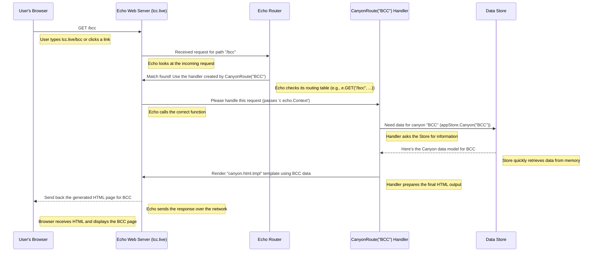

# Chapter 3: Web Server & Routing (Echo)

Welcome back! In [Chapter 2: In-Memory Data Store (`Store`)](02_in_memory_data_store___store___.md), we learned how `lcc.live` keeps all the important canyon and camera information, including the latest images, ready in the computer's fast memory (RAM). That's great, but how do we actually *see* this information in our web browser when we visit `lcc.live`?

We need a way for the application to "talk" to the internet, listen for requests from browsers, and send back the right web pages or images. This is the job of the **Web Server**. And deciding *which* page or image to send based on the URL you visit (like `/` for the main page, `/bcc` for Big Cottonwood, or `/image/some_camera_id` for a specific picture) is called **Routing**.

Think of it like visiting a restaurant:
1.  The **Web Server** is the host standing at the door, waiting for customers (web requests).
2.  Your **Request** is your order – maybe you ask for the "Daily Special" (the main page `/`) or a specific side dish ("Big Cottonwood Platter" - `/bcc`).
3.  **Routing** is the host figuring out which chef (which part of the code) needs to handle your specific order based on what you asked for (the URL path).
4.  The **Route Handler** is the specific chef who prepares your requested dish (generates the HTML page or finds the image).

In `lcc.live`, we use a popular Go library called **Echo** to build our web server and handle routing easily. Writing all this from scratch would be complicated, but Echo gives us helpful tools to do it quickly and correctly.

## What Does the Web Server Do?

The core job of the web server component is to:
1.  **Listen:** Wait for incoming connections (requests) from web browsers over the network. It usually listens on a specific "port" number, like `3000` or `80`.
2.  **Parse Request:** Understand what the browser is asking for (e.g., "GET the main page `/`" or "GET the image at `/image/LCC_Entry_Cam`").
3.  **Route:** Based on the requested URL path, decide which piece of Go code (the handler) should process this request.
4.  **Execute Handler:** Run the appropriate handler function.
5.  **Send Response:** Send the result from the handler (e.g., an HTML page, an image, or an error message) back to the browser.

## Setting Up the Echo Server

Creating the basic server object with Echo is straightforward. In `lcc.live`, this happens inside the `server.Start` function.

```go
// File: server/server.go (Simplified Setup)
package server

import "github.com/labstack/echo/v4"

func Start(store *store.Store, staticFS fs.FS, tmplFS fs.FS) (*echo.Echo, error) {
	// Create a new Echo instance (our web server object)
	e := echo.New()

	// This just makes the startup message in the console cleaner
	e.HideBanner = true

	// ... (We'll add routes and other settings here) ...

	// Return the configured Echo server instance
	return e, nil
}
```
This code creates an empty `echo.Echo` object, which is like setting up the restaurant but not telling the host where any tables are yet.

## Defining the Routes: Telling the Server Where Things Go

Now, we need to tell our Echo server how to handle different URL paths. This is routing! We define rules like "If someone asks for `/`, do *this*", "If someone asks for `/bcc`, do *that*".

Echo makes this easy with methods like `e.GET(PATH, HANDLER_FUNCTION)`. `GET` is the most common type of web request, used when your browser simply *gets* a page or image.

```go
// File: server/server.go (Simplified Routes)
import (
	"github.com/labstack/echo/v4"
	"github.com/stefanpenner/lcc-live/store" // We need the store!
	// ... other imports ...
)

func Start(appStore *store.Store, staticFS fs.FS, tmplFS fs.FS) (*echo.Echo, error) {
	e := echo.New()
	e.HideBanner = true
	// ... (other middleware setup like logging, compression) ...

	// --- Defining Routes ---

	// Handle requests for the main page (default to LCC)
	// When a GET request comes for "/", call the function returned by CanyonRoute(appStore, "LCC")
	e.GET("/", CanyonRoute(appStore, "LCC"))

	// Handle requests for the Big Cottonwood Canyon page
	// When a GET request comes for "/bcc", call the function returned by CanyonRoute(appStore, "BCC")
	e.GET("/bcc", CanyonRoute(appStore, "BCC"))

	// Handle requests for specific camera images
	// "/image/:id" - :id is a placeholder. Echo will capture the actual ID.
	// When a GET request comes for "/image/SOME_ID", call the function returned by ImageRoute(appStore)
	e.GET("/image/:id", ImageRoute(appStore))

	// There are also HEAD routes (like GET but only asking for headers, not the body)
	// and a /healthcheck route, but we'll focus on these GET routes.

	// ... (Template setup) ...
	return e, nil
}
```
**Explanation:**

*   `e.GET(...)`: We're defining rules for handling `GET` requests.
*   `/`, `/bcc`, `/image/:id`: These are the URL paths the server will listen for.
*   `:id`: This part of the path is special. It's a **parameter**. If someone requests `/image/LCC_Summit_Cam`, Echo knows that `id` is `"LCC_Summit_Cam"` for that specific request.
*   `CanyonRoute(appStore, "LCC")`, `ImageRoute(appStore)`: These are functions that *return* the actual **handler function** Echo should call. We pass the `appStore` (our data store from Chapter 2!) to these functions so the handlers can access the necessary data.

Think of this like giving the restaurant host a list:
*   "Order for `/`? Send it to the 'LCC Canyon Chef'."
*   "Order for `/bcc`? Send it to the 'BCC Canyon Chef'."
*   "Order for `/image/something`? Send it to the 'Image Chef' and tell them the 'something' part."

## The Handlers: Doing the Actual Work

Let's look at the "chefs" – the handler functions that prepare the response.

### Handling Canyon Pages (`/` and `/bcc`)

The `CanyonRoute` function *creates* the handler function for canyon pages.

```go
// File: server/canyon_route.go (Simplified)
package server

import (
	"net/http"
	"github.com/labstack/echo/v4"
	"github.com/stefanpenner/lcc-live/store" // Needs the Store
)

// CanyonRoute returns the specific handler function for a given canyonID
func CanyonRoute(appStore *store.Store, canyonID string) func(c echo.Context) error {
	// This is the function Echo will actually run for the route
	return func(c echo.Context) error {
		// 1. Use the store to get the data for this canyon (e.g., "LCC" or "BCC")
		canyonData := appStore.Canyon(canyonID) // Uses the Store from Chapter 2!

		// (We also set some caching headers here, omitted for simplicity)

		// 2. Tell Echo to render an HTML page using a template file
		//    named "canyon.html.tmpl". We pass the 'canyonData' to the template
		//    so it can display the canyon name, status, and camera list.
		return c.Render(http.StatusOK, "canyon.html.tmpl", canyonData)
	}
}
```
**Explanation:**

1.  When a request comes for `/` or `/bcc`, Echo calls the function returned by `CanyonRoute`.
2.  Inside that function, `c echo.Context` represents the current request/response interaction.
3.  `appStore.Canyon(canyonID)`: It asks the [In-Memory Data Store (`Store`)](02_in_memory_data_store___store___.md) for the data model (`Canyon`) corresponding to the requested `canyonID` ("LCC" or "BCC").
4.  `c.Render(...)`: It tells Echo to use an HTML template (like a fill-in-the-blanks form) named `canyon.html.tmpl`. It fills the blanks in the template using the `canyonData` it just fetched. The result is the complete HTML page sent back to the browser. `http.StatusOK` is the standard "everything is OK" code (200).

### Handling Image Requests (`/image/:id`)

The `ImageRoute` function creates the handler for serving specific camera images.

```go
// File: server/image_route.go (Simplified)
package server

import (
	"net/http"
	"github.com/labstack/echo/v4"
	"github.com/stefanpenner/lcc-live/store" // Needs the Store
)

// ImageRoute returns the handler function for image requests
func ImageRoute(appStore *store.Store) func(c echo.Context) error {
	// This is the function Echo will run for "/image/:id" routes
	return func(c echo.Context) error {
		// 1. Extract the 'id' parameter from the URL path.
		//    If the request was for "/image/LCC_Entry_Cam", cameraID will be "LCC_Entry_Cam".
		cameraID := c.Param("id")

		// 2. Ask the Store for the data (Camera info, Image bytes, Headers) for this cameraID.
		snapshot, found := appStore.Get(cameraID) // Uses the Store from Chapter 2!

		// 3. Check if the camera was found AND if we have image data for it
		if found && snapshot.Image != nil && snapshot.HTTPHeaders.Status == http.StatusOK {
			// (Set caching headers like ETag, Content-Type - details omitted)
			c.Response().Header().Set("Content-Type", snapshot.HTTPHeaders.ContentType)
			c.Response().Header().Set("ETag", snapshot.Image.ETag) // Unique fingerprint

			// 4. Send the raw image data back to the browser!
			//    `c.Blob` sends binary data (like an image).
			imageBytes := snapshot.Image.Bytes
			return c.Blob(http.StatusOK, snapshot.HTTPHeaders.ContentType, imageBytes)
		}

		// 5. If not found or image unavailable, send a "404 Not Found" response.
		return c.String(http.StatusNotFound, "Image not found or temporarily unavailable")
	}
}
```
**Explanation:**

1.  `c.Param("id")`: This gets the actual camera ID requested from the URL.
2.  `appStore.Get(cameraID)`: It asks the [In-Memory Data Store (`Store`)](02_in_memory_data_store___store___.md) for the `EntrySnapshot` containing the latest image bytes and related info for that camera.
3.  **Check `found` and Status:** It makes sure the camera exists and the last attempt to fetch its image was successful (`http.StatusOK`).
4.  `c.Blob(...)`: If the image is available, this sends the actual image data (`snapshot.Image.Bytes`) back to the browser, along with the correct `Content-Type` (like `image/jpeg`) so the browser knows how to display it.
5.  `c.String(http.StatusNotFound, ...)`: If the image isn't found or couldn't be fetched, it sends a simple text error message with a 404 status code.

## Request Lifecycle: From Browser to Response

Let's trace what happens when you visit `lcc.live/bcc` in your browser:



## Starting the Server: Listening for Connections

We've defined *how* to handle requests, but we need to actually start the server so it listens for them. This happens in the `main` function:

```go
// File: main.go (Simplified Startup)
package main

import (
	// ... other imports
	"github.com/stefanpenner/lcc-live/server"
	"github.com/stefanpenner/lcc-live/store"
	"log"
	"fmt"
)

func main() {
	// ... (setup context, load config, create store 'appStore') ...

	// Create the Echo app with all routes defined
	// The 'Start' function we looked at earlier is called here
	app, err := server.Start(appStore, staticFS, tmplFS) // staticFS/tmplFS hold website assets/templates
	if err != nil {
		log.Fatal(err)
	}

	config := loadConfig() // Gets config, including the Port (e.g., "3000")

	// Start the server in the background (using 'go func()')
	// so the rest of the main function can continue (e.g., waiting for shutdown)
	go func() {
		fmt.Println("✅ Web server listening on port", config.Port)
		// This line actually starts the listening process
		// It blocks here until the server stops or crashes
		if err := app.Start(":" + config.Port); err != nil {
			log.Printf("🚨 Server error: %v", err)
		}
	}()

	// ... (code to wait gracefully for shutdown signal) ...
}
```
**Explanation:**

1.  `server.Start(...)` creates our configured Echo application (`app`).
2.  `app.Start(":" + config.Port)` tells Echo to begin listening for incoming web requests on the specified port (e.g., `:3000`). The `:` is important!
3.  This is run inside a `go func() { ... }()` which is a Go way to run code concurrently in the background (a "goroutine" - more on this in [Chapter 6: Concurrency Management (`context`, `goroutines`, `sync`)](06_concurrency_management___context____goroutines____sync___.md)). This lets the server run without blocking the rest of the program startup.

Now our application is officially "on the air", waiting for visitors!

## Conclusion

In this chapter, we explored the **Web Server & Routing** component of `lcc.live`. We learned that:

*   A web server (built using the **Echo** framework) listens for incoming requests from browsers.
*   **Routing** matches the requested URL path (like `/`, `/bcc`, `/image/:id`) to specific **handler functions**.
*   Handler functions use the **`echo.Context`** to access request details (like URL parameters) and send responses.
*   Handlers often interact with the [In-Memory Data Store (`Store`)](02_in_memory_data_store___store___.md) to get the data needed (like canyon info or image bytes).
*   Handlers generate responses, which can be HTML pages (using `c.Render` with templates) or raw data like images (using `c.Blob`).
*   `app.Start()` makes the server begin listening for connections.

We now understand how `lcc.live` serves web pages and images. But the web pages themselves aren't just static; they use JavaScript to do things like automatically refresh the camera images without needing a full page reload. How does that work?

Next up: [Frontend Logic (JavaScript)](04_frontend_logic__javascript__.md)

---

Generated by [AI Codebase Knowledge Builder](https://github.com/The-Pocket/Tutorial-Codebase-Knowledge)