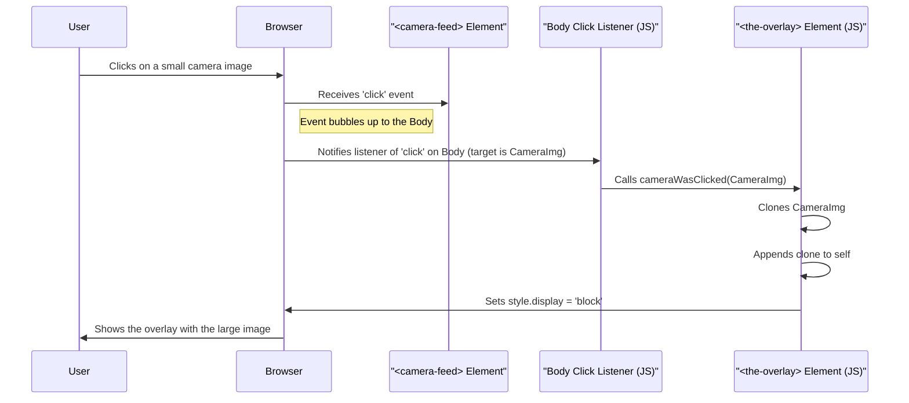

# Chapter 4: Frontend Logic (JavaScript)

Welcome to Chapter 4! In [Chapter 3: Web Server & Routing (Echo)](03_web_server___routing__echo__.md), we saw how the `lcc.live` server takes requests from your browser and sends back HTML pages and initial image data. When you first load the page, the server builds the structure – like building the stage for a play.

But what makes the webpage *interactive*? How can you click a small camera image and see a bigger version pop up? How do the images update automatically without you needing to hit refresh? That's where **Frontend Logic**, written in a language called **JavaScript**, comes in.

Think of JavaScript as the stage crew and actors who bring the set to life *after* it's been built. It runs directly inside *your* web browser, adding dynamic behavior and making the webpage feel responsive.

## What's the Point? Making the Page Interactive

Imagine the `lcc.live` page just showed static images. You'd have to manually refresh the entire page every few minutes to see if anything changed. If you wanted a closer look at a camera feed, you couldn't easily enlarge it. It wouldn't be very user-friendly!

**Central Use Case:** Let's focus on two key interactive features JavaScript enables in `lcc.live`:

1.  **Image Overlay:** When you click on a small camera image, a larger version appears centered on the screen in an "overlay" (a layer on top of the page). Clicking the overlay or pressing the 'Escape' key makes it disappear.
2.  **Automatic Image Refresh:** The camera images update periodically with the latest pictures *without* requiring a full page reload, making the experience smoother and faster.
3.  **Smart Image Loading:** Images that are not currently visible on your screen aren't loaded until you scroll down to them, saving bandwidth and making the initial page load faster.

JavaScript is the magic that makes these features possible by manipulating the webpage directly in your browser *after* the server has sent the initial HTML.

## Key JavaScript Concepts in `lcc.live`

To understand how `lcc.live` achieves this interactivity, let's look at a few core JavaScript ideas used in its `static/script.js` file:

1.  **Running in the Browser:** Unlike the Go code we've seen, JavaScript code (like `script.js`) is downloaded by your browser along with the HTML and CSS. Your browser then executes this code.
2.  **Event Handling:** JavaScript can listen for user actions, called "events". Common events include clicking a button (`click`), pressing a key (`keyup`), or scrolling the page. When an event happens on a specific HTML element (like an image), a predefined JavaScript function can run in response.
3.  **DOM Manipulation:** The "DOM" (Document Object Model) is the browser's internal representation of the HTML page structure. JavaScript can find elements in the DOM (like finding the overlay `<div>` or a specific `` tag), change their attributes (like an image's `src` URL), modify their style (like making the overlay visible or hidden), or even add/remove elements entirely.
4.  **Making Network Requests (`fetch`):** JavaScript can send requests back to the server (or other servers) *without* reloading the whole page. `lcc.live` uses this to ask the server for the *latest* version of a camera image URL (`/image/some_camera_id`) that we learned about in [Chapter 3: Web Server & Routing (Echo)](03_web_server___routing__echo__.md).
5.  **Timers (`setTimeout`, `setInterval`):** JavaScript can schedule code to run after a certain delay (`setTimeout`) or repeat at regular intervals (`setInterval`). This is used for the automatic image refresh.
6.  **Observing Elements (`IntersectionObserver`):** This is a modern browser feature that lets JavaScript efficiently detect when an element (like an image) scrolls into or out of the visible part of the browser window (the "viewport"). This is key for smart image loading.

## Implementing the Use Cases

Let's see how these concepts work together in `static/script.js`.

### 1. Image Overlay

**The Goal:** Click a small camera image (`<camera-feed>`), show a large version in the `<the-overlay>` element.

**Step 1: Listening for Clicks**
We need to know when *any* part of the page is clicked and check if that click was on a camera feed.

```javascript
// File: static/script.js (Simplified)

// Listen for ANY click happening anywhere on the page body
document.body.addEventListener("click", (e) => {
  // 'e.target' is the exact element that was clicked
  let camera = findCamera(e.target); // Helper function to find the parent <camera-feed>

  // If a camera was clicked AND the screen isn't too narrow...
  if (camera) { // Simplified: Assumes findCamera found something
    // Tell the overlay element to show the clicked camera
    document.querySelector("the-overlay").cameraWasClicked(camera);
  }
});

// Helper function to find the relevant camera element
function findCamera(target) {
  // 'closest' walks up the HTML tree to find the nearest ancestor
  // matching the 'camera-feed' tag name. Returns null if none found.
  return target.closest("camera-feed");
}
```

*   **Explanation:** We attach a "click listener" to the entire `document.body`. When a click happens, the code inside runs. `findCamera` checks if the click was inside a `<camera-feed>` element. If yes, it calls the `cameraWasClicked` method on our special `<the-overlay>` element.

**Step 2: Showing the Overlay**
The `<the-overlay>` element is defined as a "custom element" (a reusable HTML tag with its own JavaScript logic). Its `cameraWasClicked` method handles showing the image.

```javascript
// File: static/script.js (Inside the Overlay class)

class Overlay extends HTMLElement {
  // ... (constructor and other methods) ...

  // Method called when a camera is clicked
  cameraWasClicked(camera) {
    // Make a copy (clone) of the clicked camera element
    const cloned = camera.cloneNode(true);
    // Remove unnecessary attributes from the clone
    cloned.removeAttribute("tab-index");

    this.empty(); // Clear out any previous image in the overlay
    this.appendChild(cloned); // Add the cloned camera image to the overlay
    this.show(); // Make the overlay visible
  }

  // Helper to remove old content
  empty() {
    // ... (removes child nodes, clears timers) ...
  }

  // Makes the overlay visible and starts its own refresh timer
  show() {
    this.style.display = "block"; // Changes CSS to make it visible
    this.reload(); // Starts refreshing the image *inside* the overlay
  }

  // Hides the overlay
  hide() {
    this.style.display = "none"; // Changes CSS to hide it
    this.empty(); // Cleans up
  }

  // ... (constructor adds click listener to hide itself) ...
}

// Tell the browser about our custom element
customElements.define("the-overlay", Overlay);
```

*   **Explanation:** `cameraWasClicked` clones the clicked element, adds it to the overlay, and calls `show()`. `show()` changes the overlay's CSS `display` property from `none` to `block`, making it appear. `hide()` does the reverse.

**Step 3: Hiding the Overlay**
The overlay hides when clicked, or when the 'Escape' key is pressed.

```javascript
// File: static/script.js (Inside the Overlay class constructor)

  constructor() {
    super();
    // Add a click listener *directly* to the overlay element
    this.addEventListener("click", () => this.hide());
    // ...
  }

// File: static/script.js (Global key listener)

// Listen for ANY key press happening anywhere on the page
document.addEventListener("keyup", (e) => {
  switch (e.key) { // Check which key was pressed
    case "Escape": {
      // Find the overlay element and call its hide() method
      document.querySelector("the-overlay").hide();
      break;
    }
    // ... (handle 'Enter' key for accessibility) ...
  }
});
```

*   **Explanation:** A click listener *on the overlay itself* calls `hide()`. A separate global key listener checks if the 'Escape' key was pressed and calls `hide()` if it was.

**Internal Walkthrough (Overlay Click):**



### 2. Automatic Image Refresh

**The Goal:** Update the camera images (`` tags) every few seconds with fresh data from the server, without a full page reload.

**Step 1: Scheduling the Refresh**
A function `reloadImages` is set up to run repeatedly.

```javascript
// File: static/script.js (Simplified)

(async function reloadImages() {
  // Find all image elements currently in the HTML
  const imagesToReload = document.querySelectorAll("img");

  // Try to reload each image (more on reloadImage below)
  // Promise.allSettled waits for all reload attempts, even if some fail
  await Promise.allSettled(
    [...imagesToReload].map(reloadImage) // Call reloadImage for each img
  );

  // Wait for a bit (e.g., 2000ms = 2 seconds)
  await wait(2000);

  // Call itself again to create a loop
  reloadImages();
})(); // The () runs the function immediately once

// Helper function for waiting
const wait = async (time) =>
  new Promise((resolve) => setTimeout(resolve, time));
```

*   **Explanation:** This code defines an `async` function `reloadImages` and immediately runs it. Inside, it finds all `` tags, tries to reload each one using a helper function `reloadImage`, waits for 2 seconds, and then calls itself again, creating an infinite loop (with delays).

**Step 2: Reloading a Single Image (`reloadImage`)**
This is the core function that fetches new image data.

```javascript
// File: static/script.js (Simplified)

async function reloadImage(img) {
  // Keep track of the original image URL if we haven't already
  img.dataset.src = img.dataset.src || img.src;
  // Get the original URL (e.g., /image/LCC_Entry_Cam)
  const imageUrl = img.dataset.src;

  // --- Optimization: Check if visible (see next section) ---
  if (!img.classList.contains("in-viewport")) {
     return; // Don't reload if not visible
  }

  try {
    // Ask the server for the image *headers* first (using fetch)
    // We include the current ETag to ask "only give me data if it's newer"
    const request = await fetch(imageUrl, {
      // mode: 'same-origin', cache: 'default' // Standard options
      headers: {
        // Tell the server the version (ETag) we currently have
        'If-None-Match': img.dataset.etag || ''
      }
    });

    // Check the server's response status
    if (request.status === 304) {
      // 304 Not Modified: Our version is still the latest, do nothing!
      return;
    }

    if (request.status === 200) { // 200 OK: New image data received!
      // Get the new ETag (unique fingerprint) from the response headers
      const etag = request.headers.get('etag');

      // Update the image's ETag tracker
      img.dataset.etag = etag;

      // Get the image data as a 'Blob' (raw binary data)
      const imageBlob = await request.blob();
      // Create a temporary, local URL for this blob data
      const objectURL = URL.createObjectURL(imageBlob);
      // Set the image's src to this local URL - browser displays the new image!
      img.src = objectURL;

      // Optional: Clean up the old object URL later to free memory
      // (Might happen implicitly or via other cleanup logic)
    }
  } catch (error) {
    console.error("Failed to reload image:", imageUrl, error);
  }
}
```

*   **Explanation:**
    *   It gets the image's URL (stored in `img.dataset.src`).
    *   **Crucially (using `ETag`):** It uses `fetch` to make a request *back to the server* for that URL. It includes the `ETag` (a unique identifier for the image version, provided by the server, see [Chapter 2: In-Memory Data Store (`Store`)](02_in_memory_data_store___store___.md)) of the image it currently has in the `If-None-Match` header.
    *   **Server Response:**
        *   If the server sees the `ETag` matches its current version, it sends back a special `304 Not Modified` status. The browser knows this means the image hasn't changed, so `reloadImage` does nothing further. This is very efficient!
        *   If the image *has* changed, the server sends a `200 OK` status, the *new* image data, and the *new* `ETag` in the headers.
    *   **Updating the Image:**
        *   The function gets the new `ETag` and stores it (`img.dataset.etag`).
        *   It reads the image data as a `Blob`.
        *   `URL.createObjectURL(imageBlob)` creates a temporary, efficient internal URL pointing directly to the downloaded image data already in the browser's memory.
        *   Setting `img.src = objectURL` tells the browser to display this new data, updating the image instantly without needing another download.

### 3. Smart Image Loading (Lazy Loading)

**The Goal:** Only start loading and refreshing images when they are actually visible on the screen.

**Step 1: Observing Visibility**
We use the `IntersectionObserver` API to watch all images.

```javascript
// File: static/script.js (Simplified)

// Find all images on the page initially
const images = document.querySelectorAll('img');

// Create an observer instance
const observer = new IntersectionObserver((entries) => {
  // This function runs whenever an observed element's visibility changes
  entries.forEach(entry => {
    // 'entry.isIntersecting' is true if the element is at least partially visible
    if (entry.isIntersecting) {
      // Add a CSS class if it's visible
      entry.target.classList.add('in-viewport');
      // Trigger a reload *now* that it's visible
      reloadImage(entry.target);
    } else {
      // Remove the CSS class if it's no longer visible
      entry.target.classList.remove('in-viewport');
    }
  });
}, {
  // Configuration options (defaults are often fine)
  root: null, // Use the browser viewport as the reference area
  threshold: 0 // Trigger as soon as 1 pixel is visible
});

// Tell the observer to watch each image
images.forEach(img => observer.observe(img));
```

*   **Explanation:**
    *   An `IntersectionObserver` is created. It takes a function that will be executed whenever one of the watched elements enters or leaves the viewport.
    *   The function checks `entry.isIntersecting`.
    *   If `true`, it adds the class `in-viewport` to the `img` element and immediately calls `reloadImage` to load/update it.
    *   If `false`, it removes the `in-viewport` class.
    *   Finally, `observer.observe(img)` starts watching each image.

**Step 2: Checking Visibility in `reloadImage`**
The `reloadImage` function (shown in the previous section) uses this `in-viewport` class:

```javascript
// File: static/script.js (Inside reloadImage)

  // --- Optimization: Check if visible ---
  if (!img.classList.contains("in-viewport")) {
     return; // Don't reload if not visible
  }
  // --- Proceed with fetch only if visible ---
  // ... (fetch logic as before) ...
```

*   **Explanation:** The automatic refresh loop (`reloadImages`) still *tries* to reload all images every few seconds, but the `reloadImage` function now has a check at the beginning. If the image doesn't have the `in-viewport` class (meaning the `IntersectionObserver` marked it as not visible), the function simply stops, preventing the `fetch` request.

## Conclusion

We've explored how **Frontend Logic (JavaScript)**, running in the user's browser, adds interactivity and dynamic behavior to `lcc.live`. It listens for user events (like clicks), manipulates the page structure (DOM), makes background requests (`fetch`) to update data like images efficiently (using ETags), and optimizes loading using techniques like lazy loading with `IntersectionObserver`.

This JavaScript code acts *on* the data and structure initially provided by the server ([Chapter 3: Web Server & Routing (Echo)](03_web_server___routing__echo__.md)), which in turn gets its data from the [In-Memory Data Store (`Store`)](02_in_memory_data_store___store___.md).

But how does the *Store* itself keep its image data up-to-date by fetching from the original camera sources? The JavaScript asks *our* server for images, but our server needs to get them from the *actual* traffic camera websites periodically. That's the job of the background syncing process.

Next up: [Background Image Syncing](05_background_image_syncing_.md)

---

Generated by [AI Codebase Knowledge Builder](https://github.com/The-Pocket/Tutorial-Codebase-Knowledge)