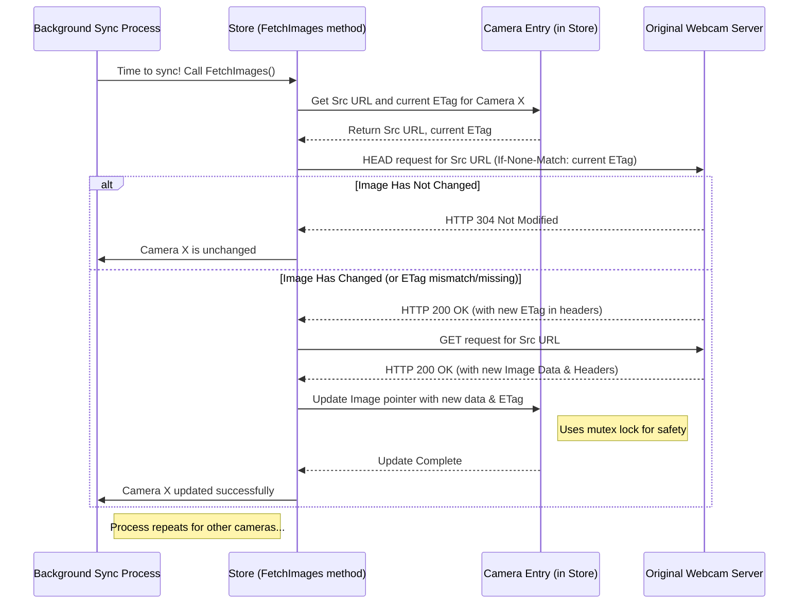

# Chapter 5: Background Image Syncing

In [Chapter 4: Frontend Logic (JavaScript)](04_frontend_logic__javascript__.md), we saw how JavaScript running in the browser can make the webpage interactive and fetch updated images from *our* server (`lcc.live`). But how does our server ensure it *has* those updated images in the first place? The original images come from various traffic camera websites, and they change over time. We need a way to keep our server's copies fresh.

If our [In-Memory Data Store (`Store`)](02_in_memory_data_store___store___.md) only loaded images once at startup, they would quickly become outdated. Users visiting `lcc.live` wouldn't see the current road conditions!

This is where **Background Image Syncing** comes in. It's like having a dedicated, tireless assistant working behind the scenes.

## The Helpful Assistant: What is Background Syncing?

Imagine you have a scrapbook (`Store`) where you want to keep the latest photos from several different websites (the original camera sources). Instead of manually checking each website every few minutes and updating the scrapbook yourself, you hire an assistant.

This assistant (our **Background Image Syncing** process):
1.  Has a list of all the websites (camera `Src` URLs) to check.
2.  Every few minutes (e.g., every 3 seconds in `lcc.live`), they visit each website.
3.  They cleverly check if the photo on the website is *newer* than the one currently in your scrapbook. Often, they can just ask the website, "Has this photo changed since version X?" using something called an `ETag` (like a photo's unique version number).
4.  If the photo *is* new, they download it.
5.  They carefully replace the old photo in your scrapbook (`Store`) with the new one.

This happens continuously in the background, completely separate from users visiting the `lcc.live` website. It's a dedicated **process** (specifically, a `goroutine` in Go, which is like a lightweight thread) whose only job is to keep the image data in the `Store` up-to-date.

**Central Use Case:** Automatically and periodically fetch the latest images from the original camera source URLs and update the corresponding image data within the application's [In-Memory Data Store (`Store`)](02_in_memory_data_store___store___.md).

## Starting the Assistant: Kicking off the Sync Process

When the `lcc.live` application starts, it needs to "hire" the assistant – meaning, it needs to start this background process. This happens in the `main` function.

```go
// File: main.go (Simplified Startup)
package main

import (
	"context" // For managing background tasks
	"fmt"
	"time" // For timing delays
	"github.com/stefanpenner/lcc-live/store" // Needs the Store!
	// ... other imports ...
)

// This function IS the assistant's main work loop
func keepCamerasInSync(ctx context.Context, appStore *store.Store, interval time.Duration) {
	// Create a timer that 'ticks' every 'interval' (e.g., 3 seconds)
	ticker := time.NewTicker(interval)
	defer ticker.Stop() // Clean up the timer when done

	// Loop forever (until the application is told to stop)
	for {
		select { // Wait for one of two things to happen:
		case <-ctx.Done(): // 1. The application is shutting down
			fmt.Println("🛑 Cancelling camera sync")
			return // Exit the loop and the function
		case <-ticker.C: // 2. The timer ticked! Time to check for new images.
			fmt.Println("🔄 Starting camera sync...")
			// Tell the store to fetch updated images from the sources
			appStore.FetchImages(ctx)
			fmt.Printf("💤 Waiting %s before next sync\n", interval)
		}
	}
}

func main() {
	// ... (setup context 'ctx', load config, create 'appStore') ...
	config := loadConfig() // Gets config, including SyncInterval

	// Start the assistant in the background!
	// 'go' keyword starts the function in a separate goroutine.
	go keepCamerasInSync(ctx, appStore, config.SyncInterval)

	fmt.Printf("🕒 Background sync scheduled every %s\n", config.SyncInterval)

	// ... (start web server, wait for shutdown signal) ...
}

// Helper function to load settings (like sync interval)
func loadConfig() Config {
    // ... (reads environment variables or sets defaults) ...
    return Config{
        // ... Port: "3000", ...
        SyncInterval: 3 * time.Second, // Default sync interval
    }
}
type Config struct { // Defines structure for config values
    Port         string
    SyncInterval time.Duration
}
```

**Explanation:**

1.  **`loadConfig()`:** Reads settings, including how often to sync (e.g., `3 * time.Second`).
2.  **`keepCamerasInSync` Function:** This is the core logic for our background assistant.
    *   It creates a `time.Ticker` that sends a signal every `interval`.
    *   The `for { select { ... } }` creates an infinite loop that waits.
    *   `<-ticker.C`: When the timer ticks, this case is chosen. It prints a message and calls `appStore.FetchImages(ctx)`. This is the crucial step where the actual checking and downloading happens.
    *   `<-ctx.Done()`: If the application receives a shutdown signal (e.g., you press Ctrl+C), the `ctx` (context) is cancelled. This case is chosen, a message is printed, and the function returns, stopping the background process gracefully. We'll learn more about `context` in [Chapter 6: Concurrency Management (`context`, `goroutines`, `sync`)](06_concurrency_management___context____goroutines____sync___.md).
3.  **`go keepCamerasInSync(...)`:** In `main`, this line starts the `keepCamerasInSync` function running concurrently in the background. The rest of the `main` function continues immediately (e.g., to start the web server), while the sync process runs independently.

## The Fetching Process: How `Store.FetchImages` Works

The `keepCamerasInSync` function delegates the actual work of checking *all* the cameras to the `Store`'s `FetchImages` method. Let's look at a simplified conceptual walkthrough of what happens inside `FetchImages` for *one* camera.

**Simplified Goal:** Update the image for camera "LCC_Entry_Cam" if it has changed on the original website.

**Conceptual Steps inside `Store.FetchImages` (for one camera):**

1.  **Get Camera Info:** Find the internal `Entry` object for "LCC_Entry_Cam" within the `Store`. Remember from [Chapter 2: In-Memory Data Store (`Store`)](02_in_memory_data_store___store___.md) that the `Entry` holds the `Camera` details (like the source URL `Src`) and the current `Image` and `HTTPHeaders` (including the `ETag` of the image we currently have).
2.  **Ask Source "Has it Changed?":** Send an efficient HTTP `HEAD` request to the camera's original `Src` URL. A `HEAD` request asks the source server for information *about* the image (like its `ETag` and `Content-Type`) but *not* the image data itself. We include the `ETag` of our current image in the `If-None-Match` header of this request.
3.  **Check Source Response:**
    *   **Case A: No Change (HTTP 304):** If the source server responds with "304 Not Modified", it means our current `ETag` matches the source's `ETag`. The image hasn't changed! We do nothing further for this camera and move to the next. This is very efficient.
    *   **Case B: Changed or Unknown (HTTP 200 or other):** If the source server sends back a different `ETag` (or doesn't support ETags well) and responds with "200 OK", it means the image *might* have changed (or we need to check).
4.  **Download New Image (If Changed):** If we got a "200 OK" in step 3, we now send a regular HTTP `GET` request to the same `Src` URL to download the actual image data (bytes).
5.  **Update the Store:** If the download was successful:
    *   We get the new image bytes and the new `HTTPHeaders` (like `Content-Type` and the *new* `ETag`) from the response.
    *   We carefully update the `Entry` object for "LCC_Entry_Cam" inside the `Store`, replacing the pointers to the old `Image` and `HTTPHeaders` with pointers to the *new* ones. This update is done safely using the locking mechanisms (`sync.RWMutex`) discussed briefly in [Chapter 2: In-Memory Data Store (`Store`)](02_in_memory_data_store___store___.md) and covered more in [Chapter 6: Concurrency Management (`context`, `goroutines`, `sync`)](06_concurrency_management___context____goroutines____sync___.md).

This process repeats for *every* camera the `Store` knows about, typically running these checks concurrently (multiple cameras at the same time) for speed.

**Mermaid Sequence Diagram: Syncing One Camera**



## Looking at the Code: `Store.FetchImages` (Simplified)

The actual `FetchImages` code handles many cameras at once and includes error handling, but here's a very simplified version focusing on the core logic for one camera:

```go
// File: store/store.go (Simplified concept within FetchImages)

func (s *Store) FetchImages(ctx context.Context) {
	fmt.Println("📸 Starting image fetch...")
	// ... (Loop through all s.entries, potentially using goroutines for concurrency) ...

	// --- Simplified logic for ONE entry ---
	entry := s.entries[0] // Example: just process the first entry

	// Read current details safely
	var currentETag string
	var cameraSrc string
	entry.Read(func(e *Entry) { // Safely read using the Entry's lock
		if e.HTTPHeaders != nil {
			currentETag = e.HTTPHeaders.ETag
		}
		cameraSrc = e.Camera.Src
	})

	// 1. Make HEAD request to check ETag
	headReq, _ := http.NewRequestWithContext(ctx, "HEAD", cameraSrc, nil)
	if currentETag != "" {
		headReq.Header.Set("If-None-Match", currentETag)
	}
	headResp, err := s.client.Do(headReq)
	// ... (handle errors) ...
	headResp.Body.Close() // Close response body even for HEAD

	// 2. Check if image changed (ETag mismatch or 200 OK)
	newETag := headResp.Header.Get("ETag")
	if headResp.StatusCode == http.StatusNotModified {
		fmt.Printf("✅ Image %s unchanged (ETag matched).\n", cameraSrc)
		return // Or continue to next camera in the loop
	}
	if headResp.StatusCode != http.StatusOK {
		fmt.Printf("⚠️ Unexpected status %d for HEAD %s.\n", headResp.StatusCode, cameraSrc)
		// Decide whether to proceed or skip... maybe proceed cautiously
	}

	// 3. Make GET request to fetch new image data
	getReq, _ := http.NewRequestWithContext(ctx, "GET", cameraSrc, nil)
	getResp, err := s.client.Do(getReq)
	// ... (handle errors, check for StatusOK) ...
	defer getResp.Body.Close()

	// 4. Read the new image bytes
	imageBytes, err := io.ReadAll(getResp.Body)
	// ... (handle read errors) ...

	// Calculate our own ETag based on content (optional fallback)
	contentETag := "\"" + strconv.FormatUint(xxhash.Sum64(imageBytes), 10) + "\""
	if newETag == "" { // Use source ETag if available, otherwise ours
		newETag = contentETag
	}

	// 5. Update the Store Entry safely
	entry.Write(func(e *Entry) { // Safely write using the Entry's lock
		e.Image = &Image{ // Create NEW Image struct
			Bytes: imageBytes,
			ETag:  contentETag, // Store our calculated ETag
			Src:   e.Camera.Src,
		}
		e.HTTPHeaders = &HTTPHeaders{ // Create NEW HTTPHeaders struct
			Status:        http.StatusOK,
			ContentType:   getResp.Header.Get("Content-Type"),
			ContentLength: getResp.ContentLength,
			ETag:          newETag, // Store the ETag from the source response
		}
	})
	fmt.Printf("🔄 Image %s updated successfully.\n", cameraSrc)

	// ... (End of loop for all entries) ...
	fmt.Println("✨ Fetch complete.")
}
```

**Key Takeaways from the Code:**

*   **Efficiency:** It prioritizes the cheap `HEAD` request and `ETag` check to avoid downloading unchanged images.
*   **Updating:** It reads the image bytes using `io.ReadAll`.
*   **Safety:** It uses `entry.Read(...)` and `entry.Write(...)` helper methods (which internally use the `sync.RWMutex` mentioned in [Chapter 2: In-Memory Data Store (`Store`)](02_in_memory_data_store___store___.md)) to safely access and update the shared `Entry` data, preventing conflicts between the background sync and web server requests trying to read the same data.
*   **Immutability Principle:** Notice how `entry.Write` assigns completely *new* `Image` and `HTTPHeaders` structs (`&Image{...}`, `&HTTPHeaders{...}`). It doesn't modify the old ones. This makes it safer for parts of the application that might still be holding a reference (a snapshot) to the *old* data.

## Conclusion

We've learned about the **Background Image Syncing** process in `lcc.live`. It's a dedicated background task (`goroutine`) that runs continuously, triggered by a timer. Its job is to:

1.  Periodically check the original camera sources.
2.  Use efficient methods like `HEAD` requests and `ETags` to see if images have changed.
3.  Download new image data only when necessary.
4.  Safely update the central [In-Memory Data Store (`Store`)](02_in_memory_data_store___store___.md) with the fresh image bytes and headers.

This ensures that the data served by our [Web Server & Routing (Echo)](03_web_server___routing__echo__.md) and requested by the [Frontend Logic (JavaScript)](04_frontend_logic__javascript__.md) stays reasonably current.

This background process runs *concurrently* with the web server handling user requests. How does Go manage these multiple things happening at the same time without them interfering with each other? How do we ensure data is updated safely? That requires careful **Concurrency Management**.

Next up: [Concurrency Management (`context`, `goroutines`, `sync`)](06_concurrency_management___context____goroutines____sync___.md)

---

Generated by [AI Codebase Knowledge Builder](https://github.com/The-Pocket/Tutorial-Codebase-Knowledge)