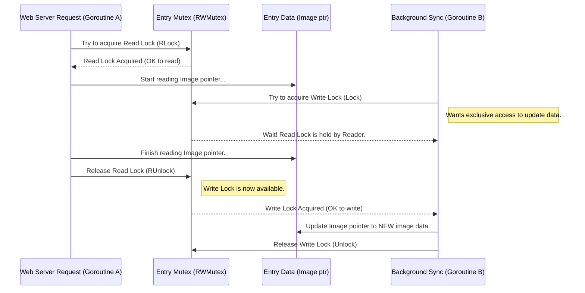

# Chapter 6: Concurrency Management (`context`, `goroutines`, `sync`)

In [Chapter 5: Background Image Syncing](05_background_image_syncing_.md), we learned how `lcc.live` keeps its camera images fresh by running a background process that periodically fetches updates from the original sources. This background sync runs *at the same time* as the [Web Server & Routing (Echo)](03_web_server___routing__echo__.md) is handling requests from users visiting the site.

Think about it: the application is doing multiple things seemingly simultaneously!
1.  The web server is responding to browser requests for pages and images.
2.  The background sync is fetching new images from external websites.

How does the application manage these different tasks without them tripping over each other? What happens if two tasks try to update the same piece of data (like an image in the [In-Memory Data Store (`Store`)](02_in_memory_data_store___store___.md)) at the exact same moment? And how do we tell all these tasks to stop cleanly when we want to shut down the application?

This is where **Concurrency Management** comes in. It's like being the manager of a busy team of workers. You need to:
*   Start workers (`goroutines`) on different tasks.
*   Ensure workers don't interfere with each other when using shared tools (like data in the `Store`, using `sync` primitives).
*   Tell all workers when it's time to pack up and go home (using `context`).

Go has excellent built-in tools for managing concurrency, making it relatively straightforward compared to many other languages. Let's explore the key tools used in `lcc.live`.

## Key Concepts: The Manager's Toolkit

### 1. Goroutines: Your Concurrent Workers

Imagine you need two things done at once: answering the phone and filing papers. Instead of doing a little bit of one, then switching to the other, you hire two assistants. One answers phones, the other files papers. They work *concurrently*.

In Go, a **goroutine** is like one of these assistants. It's an independent task that can run alongside other tasks. Starting a goroutine is incredibly simple using the `go` keyword.

**Example:** Starting the background sync worker in `main.go`:

```go
// File: main.go (Simplified)

func main() {
	// ... (setup context 'ctx', store 'appStore', config) ...

	// Start keepCamerasInSync in the background as a goroutine
	go keepCamerasInSync(ctx, appStore, config.SyncInterval)

	// The program continues running here IMMEDIATELY,
	// while keepCamerasInSync runs concurrently.
	fmt.Printf("🕒 Background sync scheduled...\n")

	// ... (start web server, wait for shutdown) ...
}

// This function runs concurrently
func keepCamerasInSync(ctx context.Context, store *store.Store, interval time.Duration) {
	// ... (loop checking ctx.Done() and ticker.C) ...
}
```

*   **Explanation:** The line `go keepCamerasInSync(...)` starts the `keepCamerasInSync` function as a separate goroutine. The `main` function doesn't wait for it to finish; it immediately moves on to the next line. Now, the background sync process is running *concurrently* with the main part of the program (which soon starts the web server, another concurrent process!).

Goroutines are very "lightweight," meaning you can have thousands or even millions running without overwhelming the system, unlike traditional operating system threads.

### 2. `sync` Package: Coordinating Your Workers

Now you have multiple workers (goroutines) running. What if they need to use the same tool, like a specific filing cabinet (our shared data in the `Store`)? If two workers try to put different files in the same spot at the same time, you'll have a mess!

The `sync` package provides tools to prevent these kinds of conflicts.

**a) `sync.Mutex` and `sync.RWMutex`: The Talking Stick**

A `Mutex` (Mutual Exclusion lock) is like a "talking stick." Only the worker holding the stick is allowed to speak (access the shared resource). Other workers have to wait their turn.

An `RWMutex` (Read-Write Mutex) is a bit more flexible. It's like having two rules for the filing cabinet:
*   If someone is *writing* to the cabinet (putting files in or taking them out), nobody else can access it (read *or* write). They hold the "write stick."
*   If multiple people just want to *read* from the cabinet (look at files without changing anything), they can all do so at the same time. They each hold a "read stick." But if someone wants to *write*, they have to wait for all readers to finish, and then grab the "write stick."

In `lcc.live`, the `Store` uses an `RWMutex` to protect each camera's `Entry` data, particularly the `Image` and `HTTPHeaders` pointers which can be updated by the background sync (writer) and read by web requests (readers).

```go
// File: store/store.go (Simplified Entry struct)

import "sync"

type Entry struct {
	// ... Camera info ...
	Image       *Image        // Pointer to the current image data
	HTTPHeaders *HTTPHeaders  // Pointer to current headers
	// ... ID ...
	mu          sync.RWMutex  // The 'talking stick' for THIS entry
}

// Method to safely READ data from the Entry
func (e *Entry) Read(fn func(*Entry)) {
	e.mu.RLock() // Grab a 'read stick'
	defer e.mu.RUnlock() // Release the 'read stick' when done
	fn(e) // Execute the provided function while holding the lock
}

// Method to safely WRITE data to the Entry
func (e *Entry) Write(fn func(*Entry)) {
	e.mu.Lock() // Grab the 'write stick' (exclusive access)
	defer e.mu.Unlock() // Release the 'write stick' when done
	fn(e) // Execute the provided function while holding the lock
}
```

*   **Explanation:**
    *   Each `Entry` has its own `sync.RWMutex` named `mu`.
    *   The `Read` method uses `e.mu.RLock()` to acquire a read lock. Multiple goroutines can acquire a read lock simultaneously. `defer e.mu.RUnlock()` ensures the lock is released when the `Read` function finishes.
    *   The `Write` method uses `e.mu.Lock()` to acquire the exclusive write lock. Only one goroutine can hold the write lock at a time. Any readers or other writers must wait. `defer e.mu.Unlock()` ensures release.
    *   This prevents the background sync from changing the `Image` pointer while a web request is trying to read it, avoiding inconsistent data.

**b) `sync.WaitGroup`: Waiting for the Team**

Sometimes, a manager needs to start several workers on related tasks and then wait for *all* of them to finish before proceeding. For example, the `Store.FetchImages` function starts multiple goroutines, one for each camera, to fetch images concurrently. It needs to wait for all these fetches to complete before it can report the overall status.

A `sync.WaitGroup` helps manage this. Think of it as a counter:
1.  The manager sets the counter to the number of workers they're starting (`wg.Add(N)`).
2.  Each worker tells the manager they're done when they finish their task (`wg.Done()`).
3.  The manager waits until the counter reaches zero (`wg.Wait()`).

```go
// File: store/store.go (Simplified FetchImages)

func (s *Store) FetchImages(ctx context.Context) {
	var wg sync.WaitGroup // Create a WaitGroup

	// Loop through all camera entries
	for i := range s.entries {
		entry := s.entries[i]
		// ... (skip if iframe) ...

		wg.Add(1) // Increment counter: starting one worker

		// Start a goroutine for this specific camera
		go func(entry *Entry) {
			// DEFER telling the manager we're done
			defer wg.Done() // Decrement counter when this goroutine finishes

			// ... (Actual image fetching logic for this 'entry') ...
			// ... (Uses entry.Read and entry.Write with locks) ...

		}(entry) // Pass the entry to the goroutine
	}

	// Wait here until the counter reaches zero (all goroutines called Done)
	wg.Wait()

	fmt.Println("✨ Fetch complete.")
	// ... (Update first image ready signal, print summary) ...
}
```

*   **Explanation:**
    *   A `sync.WaitGroup` named `wg` is created.
    *   Inside the loop, `wg.Add(1)` increases the counter just before starting a goroutine for an image fetch.
    *   Inside the goroutine, `defer wg.Done()` ensures that the counter is decreased when the goroutine finishes, no matter how it exits (success or error).
    *   After the loop, `wg.Wait()` blocks the `FetchImages` function until all the launched goroutines have called `Done()`. This ensures all image fetches are attempted before `FetchImages` returns.

### 3. `context` Package: The "Stop Work" Signal

You've got your workers running, coordinating with locks, and maybe waiting for each other. But what happens when it's time to shut down the entire application (e.g., you press Ctrl+C in the terminal)? You need a way to tell all your long-running background workers (like the `keepCamerasInSync` loop) to stop gracefully.

The `context` package provides a standard way to do this. Think of it like passing a special memo (`Context` object) down a chain of command. When the main manager decides it's time to stop, they "cancel" the main memo. Anyone holding a copy of that memo (or a memo derived from it) can check if it has been cancelled and react accordingly.

**How it's used in `lcc.live`:**

1.  **Creation:** In `main.go`, a root `context` is created, and a `cancel` function is obtained.

    ```go
    // File: main.go
    import "context"
    import "os/signal" // For catching Ctrl+C
    import "syscall"

    func main() {
    	// Create a context that can be cancelled.
    	// 'cancel' is a function we call later to signal shutdown.
    	ctx, cancel := context.WithCancel(context.Background())
    	// Ensure cancel() is called eventually, e.g., when main exits
    	defer cancel()

    	// Setup listening for Ctrl+C (SIGINT) or termination (SIGTERM)
    	sigChan := make(chan os.Signal, 1)
    	signal.Notify(sigChan, syscall.SIGINT, syscall.SIGTERM)

    	// ... (start store, background sync, server, passing 'ctx' down) ...

    	// Wait here until a shutdown signal is received
    	<-sigChan
    	fmt.Println("\n🚨 Shutdown signal received.")

    	// Signal cancellation to all tasks using this context!
    	cancel()

    	// ... (give server time to shut down gracefully) ...
    	fmt.Println("👋 Exiting.")
    }
    ```

2.  **Passing:** This `ctx` is passed down to functions that start long-running tasks or potentially blocking operations, like `keepCamerasInSync` and `Store.FetchImages`.

    ```go
    // File: main.go
    // Pass the cancellable context to the background sync
    go keepCamerasInSync(ctx, appStore, config.SyncInterval)

    // File: store/store.go (FetchImages signature)
    // FetchImages also accepts the context
    func (s *Store) FetchImages(ctx context.Context) {
    	// ... it passes ctx to http.NewRequestWithContext ...
    }
    ```

3.  **Checking:** Inside the long-running tasks or potentially blocking operations, the code periodically checks if the context has been cancelled.

    ```go
    // File: main.go (keepCamerasInSync loop)
    func keepCamerasInSync(ctx context.Context, /*...*/) error {
    	ticker := time.NewTicker(interval)
    	defer ticker.Stop()
    	for {
    		select { // The 'select' statement waits for ONE case to proceed
    		case <-ctx.Done(): // Check if the context's 'Done' channel is closed
    			fmt.Println(style.Cancel.Render("🛑 Cancelling camera sync"))
    			return ctx.Err() // Exit because context was cancelled
    		case <-ticker.C: // Or, the timer ticked
    			// ... do the sync work (calling store.FetchImages(ctx)) ...
    		}
    	}
    }

    // File: store/store.go (Inside FetchImages goroutine)
    // When creating HTTP requests, use the context:
    headReq, err := http.NewRequestWithContext(ctx, "HEAD", src, nil)
    // If the context is cancelled while the HTTP request is in flight,
    // the request will be aborted, preventing indefinite hangs.
    ```

*   **Explanation:**
    *   `context.WithCancel` creates a context and a function (`cancel`) to signal it.
    *   The `ctx` is passed down through function calls.
    *   The `select` statement in `keepCamerasInSync` is key. It waits for *either* the timer (`ticker.C`) *or* the context cancellation signal (`ctx.Done()`). If `ctx.Done()` receives a signal (because `cancel()` was called in `main`), the loop exits gracefully.
    *   Using `http.NewRequestWithContext` allows the HTTP client to automatically abort requests if the context is cancelled, preventing goroutines from getting stuck waiting for network responses during shutdown.

## Internal Walkthrough: Preventing Data Races with `RWMutex`

Let's visualize how the `RWMutex` prevents a problem when the background sync tries to update an image while a web request tries to read it.

**Scenario:**
1.  Web Server Goroutine (Reader) wants to read the image for "LCC_Entry_Cam".
2.  Background Sync Goroutine (Writer) has just downloaded a *new* image for "LCC_Entry_Cam" and wants to update the `Store`.



**Outcome:** The `RWMutex` ensured that the Writer had to wait until the Reader was finished. This prevents the Reader from potentially seeing inconsistent data (e.g., getting the old image headers but the new image bytes). Similarly, if the Writer held the lock first, any Readers would have to wait until the update was complete.

## Conclusion

Concurrency Management is crucial for applications like `lcc.live` that perform multiple tasks simultaneously. We've learned about Go's primary tools for this:

*   **`goroutines`:** Lightweight, concurrent workers started with the `go` keyword. Used for background tasks like image syncing and handling web requests.
*   **`sync` package:**
    *   `RWMutex`: Protects shared data (like `Store` entries) from race conditions by controlling read/write access (like a talking stick).
    *   `WaitGroup`: Allows a goroutine to wait for a group of other goroutines to complete their tasks (like a manager waiting for the team).
*   **`context` package:** Provides a standard way to signal cancellation or timeouts down a chain of goroutines, enabling graceful shutdown (like a "stop work" memo).

These tools work together to ensure `lcc.live` can efficiently handle background updates and user requests concurrently, while maintaining data integrity and shutting down cleanly.

So far, we've seen how data is modeled, stored, served, updated in the background, and managed concurrently. But where do the website's assets like CSS files, JavaScript files (`script.js`), and even the initial data (`data.json`) actually come from? Do we need to deploy them as separate files alongside our Go application? `lcc.live` uses a neat trick to bundle everything together.

Next up: [Embedded Assets (`embed`)](07_embedded_assets___embed___.md)

---

Generated by [AI Codebase Knowledge Builder](https://github.com/The-Pocket/Tutorial-Codebase-Knowledge)