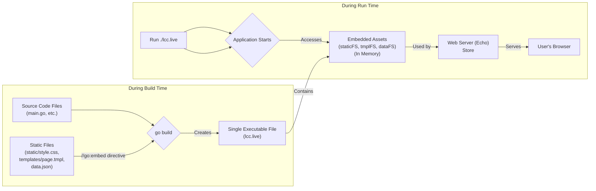

# Chapter 7: Embedded Assets (`embed`)

Welcome to the final chapter of our core technical walkthrough! In [Chapter 6: Concurrency Management (`context`, `goroutines`, `sync`)](06_concurrency_management___context____goroutines____sync___.md), we saw how `lcc.live` manages multiple tasks happening simultaneously, like handling web requests and fetching image updates in the background.

Now, let's address a practical question: Our web application needs more than just Go code. It needs HTML files for the page structure, CSS files for styling, JavaScript files for interactivity ([Chapter 4: Frontend Logic (JavaScript)](04_frontend_logic__javascript__.md)), and maybe even initial configuration data like the list of cameras ([Chapter 1: Data Models (`Canyons`, `Camera`, `Image`)](01_data_models___canyons____camera____image___.md)). How do we make sure all these files are present when we run our application?

## The Problem: Shipping Loose Parts

Imagine you bake a fantastic cake (your Go application). But then you have to carry the frosting, sprinkles, and candles in separate bags (your HTML, CSS, JS, JSON files). When you get to the party (deployment), you have to make sure you brought all the bags and put them in the right place next to the cake. If you forget a bag or put it in the wrong spot, the final presentation won't work correctly. This is how deploying applications with separate static files often feels – it's easy to misplace things or create complex deployment scripts.

**Central Use Case:** How can we bundle all the necessary static files (HTML templates, CSS stylesheets, JavaScript code, initial `data.json`) directly *inside* our main Go application executable, so we only need to deploy a single file?

## The Solution: Baking Everything In with `embed`

Go provides a fantastic solution for this called the `embed` package. It allows you to tell the Go compiler: "Hey, take these specific files and folders and bake them directly into the final application file (the binary)."

**Analogy:** Using `embed` is like baking all the ingredients *into* the cake. The frosting, sprinkles, and decorations are part of the cake itself. You just carry the cake, and everything is already there, perfectly assembled!

When you build your Go application, the `embed` package copies the contents of the specified files into the executable. When your application runs, it can access these bundled files directly from memory as if they were a small, built-in file system.

## How `lcc.live` Uses `embed`

In `lcc.live`, we use `embed` to bundle three main types of assets. This happens in the `main.go` file using a special comment directive: `//go:embed`.

```go
// File: main.go (Top Level)

package main

import (
	"embed" // Import the embed package
	"io/fs"   // Used for filesystem interfaces
	// ... other imports
)

// All assets are provided as part of the same binary using go:embed
// to keep stuff organized, we provide 3 seperate embedded file systems

// seed data
// Tells Go to embed the file 'data.json' into the 'dataFS' variable.
//go:embed data.json
var dataFS embed.FS

// assets for web serving (css, images etc)
// Tells Go to embed ALL files within the 'static' directory
// into the 'staticFS' variable. The '/**' is not needed here.
//go:embed static/*
var staticFS embed.FS

// templates
// Tells Go to embed ALL files within the 'templates' directory
// into the 'tmplFS' variable.
//go:embed templates/*
var tmplFS embed.FS

// ... rest of main.go ...
```

**Explanation:**

1.  **`import "embed"`:** We first need to import the `embed` package.
2.  **`//go:embed data.json`:** This special comment *must* be right above a variable declaration. It tells the Go compiler to find the file `data.json` (relative to the `main.go` file's location) and make its content available through the `dataFS` variable.
3.  **`//go:embed static/*`:** The `*` acts like a wildcard. This embeds all files directly inside the `static` directory.
4.  **`//go:embed templates/*`:** Similarly, this embeds all files directly inside the `templates` directory.
5.  **`var dataFS embed.FS`:** The variable itself (`dataFS`, `staticFS`, `tmplFS`) is declared with the type `embed.FS`. This type acts like a read-only file system living in your application's memory, holding the contents of the embedded files.

Now, when we build `lcc.live` (e.g., using `go build`), the contents of `data.json`, `static/script.js`, `static/style.css`, `templates/canyon.html.tmpl`, etc., are all included within the single `lcc.live` executable file.

## Accessing the Embedded Files

Okay, the files are baked in. How does the application actually *use* them at runtime? It uses the `embed.FS` variables we just declared.

### 1. Loading Initial Data (`data.json`)

Remember how the [In-Memory Data Store (`Store`)](02_in_memory_data_store___store___.md) loads its initial configuration? Instead of reading from the actual disk, it reads from the embedded `dataFS`.

```go
// File: main.go (Inside main function)

	// Create the Store, passing the embedded filesystem 'dataFS'
	// and the name of the file to load from it.
	appStore, err := store.NewStoreFromFile(dataFS, "data.json")
	if err != nil {
		log.Fatalf("failed to create store: %v", err)
	}

	// The store can now read 'data.json' directly from memory via 'dataFS'.
```

*   **Explanation:** We pass `dataFS` to the `store.NewStoreFromFile` function. Internally, the store uses methods provided by the `embed.FS` interface (like `ReadFile`) to get the contents of `data.json` directly from the embedded data. No need to look for a separate `data.json` file on the disk!

### 2. Serving Static Assets (CSS, JS)

The [Web Server & Routing (Echo)](03_web_server___routing__echo__.md) needs to serve files like `style.css` and `script.js`. Echo can serve files directly from an `fs.FS` interface, which `embed.FS` satisfies.

```go
// File: main.go (Inside main function)

	// We need to potentially get a "sub-filesystem" if the files
	// weren't embedded at the root. (Not strictly needed here due to '*' usage)
	// static, err := fs.Sub(staticFS, "static")
	// ... error handling ...
	// NOTE: Because we used `static/*`, the files are at the root of staticFS.

	// Pass the embedded 'staticFS' to the server setup function.
	app, err := server.Start(appStore, staticFS, tmplFS)
	if err != nil {
		log.Fatal(err)
	}


// File: server/server.go (Inside server.Start function)

	// Tell Echo to serve files from the '/s' URL path
	// using the provided embedded filesystem 'staticFS'.
	e.StaticFS("/s", staticFS)
```

*   **Explanation:**
    *   In `main.go`, `staticFS` is passed to `server.Start`.
    *   Inside `server.Start`, `e.StaticFS("/s", staticFS)` configures Echo. When a browser requests a URL like `/s/style.css`, Echo looks for `style.css` inside the `staticFS` embedded filesystem and serves its content directly from memory.

### 3. Loading HTML Templates

Similarly, Echo's template rendering system needs to load the `.tmpl` files. We can configure it to read these from the embedded `tmplFS`.

```go
// File: main.go (Inside main function)

	// We need to potentially get a "sub-filesystem". (Not strictly needed here)
	// tmpl, err := fs.Sub(tmplFS, "templates")
	// ... error handling ...
	// NOTE: Because we used `templates/*`, the files are at the root of tmplFS.

	// Pass the embedded 'tmplFS' to the server setup function.
	app, err := server.Start(appStore, staticFS, tmplFS)
	if err != nil {
		log.Fatal(err)
	}

// File: server/server.go (Inside server.Start function)

import (
	"html/template"
	"io/fs" // Needed for fs.FS
)

// ... (TemplateRenderer struct definition) ...

func Start(store *store.Store, staticFS fs.FS, tmplFS fs.FS) (*echo.Echo, error) {
	// ... (Echo setup) ...

	// Parse all templates ending in '.tmpl' directly from the embedded 'tmplFS'.
	tmpl, err := template.New("").ParseFS(tmplFS, "*.tmpl")
	if err != nil {
		return nil, err // Failed to load/parse templates
	}

	// Setup the custom renderer using the parsed templates.
	renderer := &TemplateRenderer{templates: tmpl}
	e.Renderer = renderer

	// ... (Define routes like e.GET("/", ...)) ...

	return e, nil
}
```

*   **Explanation:**
    *   In `main.go`, `tmplFS` is passed to `server.Start`.
    *   Inside `server.Start`, `template.New("").ParseFS(tmplFS, "*.tmpl")` is the key line. It tells Go's `html/template` package to find all files matching `*.tmpl` within the `tmplFS` embedded filesystem and parse them.
    *   The resulting `tmpl` object (containing all parsed templates) is used to create the Echo renderer. When a route handler calls `c.Render(..., "canyon.html.tmpl", ...)`, Echo uses the template definition loaded directly from the embedded data.

## Internal Walkthrough: From File to Memory

Let's visualize the journey of a file like `static/style.css` when using `embed`.



**Explanation:**

1.  **Build Time:** When you run `go build`, the compiler sees the `//go:embed` directives in `main.go`. It reads the contents of the specified files (`static/style.css`, `data.json`, etc.). It then packages these contents directly into the output executable file (`lcc.live`).
2.  **Run Time:** When you execute `./lcc.live`, the operating system loads the entire file into memory. The Go runtime makes the embedded file contents accessible via the `embed.FS` variables (`staticFS`, `tmplFS`, `dataFS`). These variables essentially provide a window into that specific portion of the application's memory, treating it like a file system.
3.  **Usage:** Other parts of the application (like the Store loading `data.json` or Echo serving `/s/style.css`) interact with these `embed.FS` variables to read the file data directly from memory.

## Benefits of Using `embed`

*   **Simplified Deployment:** The biggest win! You only need to copy and run a *single* executable file. No need to worry about separate asset directories, relative paths during deployment, or complex packaging scripts. Everything the application needs (except external services it connects to) is self-contained.
*   **Consistency:** The assets are versioned along with your Go code. When you build the binary, you capture the exact version of the CSS, JS, and template files that were present at build time. This avoids mismatches where the code expects one version of a file, but a different version is deployed.
*   **Potential Performance:** Reading files directly from memory can sometimes be faster than reading them from disk, although this is usually less significant for small web assets compared to the deployment simplification.

## Conclusion

We've learned how Go's `embed` package allows `lcc.live` to bundle static assets like configuration (`data.json`), CSS, JavaScript (`static/*`), and HTML templates (`templates/*`) directly into the main application binary.

This is achieved using the `//go:embed` directive and `embed.FS` variables. At runtime, the application accesses these embedded files directly from memory, simplifying configuration loading ([In-Memory Data Store (`Store`)](02_in_memory_data_store___store___.md)), static file serving, and template rendering ([Web Server & Routing (Echo)](03_web_server___routing__echo__.md)). The primary benefit is drastically simplified deployment – just ship the single executable file!

This concludes our tour through the core technical concepts of the `lcc.live` project. We hope this journey, from data models and storage to web serving, background tasks, concurrency, and asset embedding, has given you a clear understanding of how the different pieces fit together. Happy coding!

---

Generated by [AI Codebase Knowledge Builder](https://github.com/The-Pocket/Tutorial-Codebase-Knowledge)