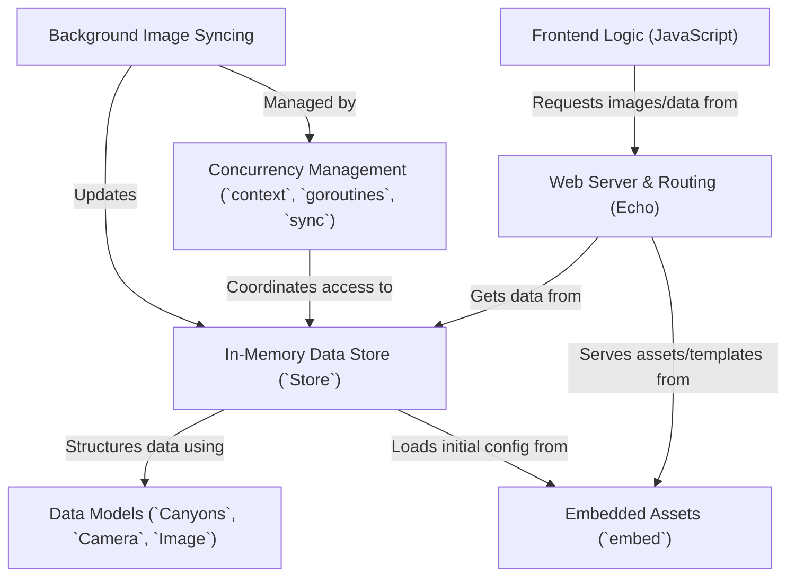

# Tutorial: lcc.live

The `lcc.live` project runs a **web server** that displays *near real-time* images from webcams in Utah's **Little Cottonwood (LCC)** and **Big Cottonwood (BCC)** canyons.
It efficiently fetches and caches these images *in memory* using background processes, making the website fast and responsive.
The frontend webpage uses JavaScript for a smoother user experience, handling things like image overlays and automatic refreshing without full page reloads.

**Source Repository:** [None](None)

## Chapters

1. [Data Models (`Canyons`, `Camera`, `Image`)
](01_data_models___canyons____camera____image___.md)
2. [In-Memory Data Store (`Store`)
](02_in_memory_data_store___store___.md)
3. [Web Server & Routing (Echo)
](03_web_server___routing__echo__.md)
4. [Frontend Logic (JavaScript)
](04_frontend_logic__javascript__.md)
5. [Background Image Syncing
](05_background_image_syncing_.md)
6. [Concurrency Management (`context`, `goroutines`, `sync`)
](06_concurrency_management___context____goroutines____sync___.md)
7. [Embedded Assets (`embed`)
](07_embedded_assets___embed___.md)

---

Generated by [AI Codebase Knowledge Builder](https://github.com/The-Pocket/Tutorial-Codebase-Knowledge)